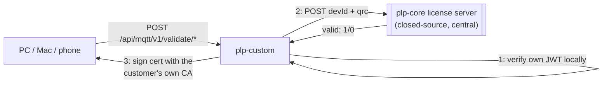

# plp-custom

Per-customer Java service that issues client certificates for PhraseLock's
private communication channel. Deployed by
[PhraseLock-Bridge](https://github.com/phraselock/PhraseLock-Bridge)'s
`PLPServer` installer, running behind nginx on `127.0.0.1:7070`.

## What it does

A PC/Mac or smartphone doesn't get a client certificate just by asking for
one — issuing one is gated on a live license check against `plp-core`
(PhraseLock's central license server, closed-source, never runs at the
customer's site). Every certificate request goes through:

1. **Local JWT check** — `plp-custom` first verifies its own `pl.core.jwt`
   bearer token (signature + expiry, against `plp-core`'s public key) using
   the standard `io.jsonwebtoken` library. An expired or invalid token
   fails the request immediately, no network call needed.
2. **License check with plp-core** — if the token is valid, `plp-custom`
   calls `plp-core`'s `/api/plp/v1/validate/licverify/` with the device ID
   and QR-pairing code (from the phone scanning a QR code shown by the
   PC/Mac client), authenticated with the same bearer token. `plp-core`
   confirms whether that pairing is licensed.
3. **Certificate issuance** — only if `plp-core` says the pairing is valid
   does `plp-custom` sign a certificate, using CA private keys copied onto
   this device by `PhraseLock-Bridge` at install time (never `plp-core`'s
   own keys — each customer has their own CA).

This is enforced server-side by `plp-core`, not by `plp-custom` itself —
so it can't be bypassed just because `plp-custom`'s own code is open
source.

## API

One route family, dispatched by the segment after `validate`:

| Endpoint | Purpose |
|---|---|
| `POST /api/mqtt/v1/validate/clientcert` | Issue a client cert (Windows/Android: from the device's own public key) or a PKCS12 bundle (Apple) |
| `POST /api/mqtt/v1/validate/clientcertmd` (alias `clientcertios`) | PKCS12 for iOS, with a dynamic Extended-Key-Usage OID |
| `POST /api/mqtt/v1/validate/clientcertand` | Android variant of `clientcert` |
| `GET/POST /api/mqtt/v1/validate/test` | Echoes whether the request came in with a verified mTLS client cert (`X-Client-Verify` header from nginx) |

Requests are JSON by default (`devId`, `qrc`, `os`, `tls`, `port`,
`pubpemb64`, `defaultMode`, `oidExt` as applicable); set `asXML=1` for an
XML response instead.

## Certificates issued

| Target | How | Validity |
|---|---|---|
| Windows / Android | Signs the device-submitted public key directly (CSR-style) | 365 days |
| macOS / Android (PKCS12) | Generates a fresh EC (secp256r1) key pair server-side, bundles key + cert + CA cert into a password-protected PKCS12 | 3650 days |
| iOS (PKCS12) | Same as above, plus a dynamic Extended-Key-Usage OID per request | 3650 days |

All certificates: `SHA256withECDSA`, `keyUsage=digitalSignature`,
`extendedKeyUsage` includes `clientAuth` plus a PhraseLock-specific OID
(`1.3.6.1.4.1.59269.100.x`) distinguishing certificate purpose (e.g. main
API vs. MQTT) — which CA is used for signing is selected by the `port`
parameter (`CaKeyStore.loadForPort`), so one instance can issue certs
against more than one of the customer's own CAs (e.g. `ca.<dname>` for the
API, `ca.mqtt_8883` for MQTT).

## Configuration

`src/main/resources/application.properties` ships with placeholders only
(`changeme` / `<bearer-token>`) — an external `application.properties` next
to the JAR (or the path given via the `app.config` system property)
overrides them at runtime, so real secrets never have to live in the JAR
or in git. `PhraseLock-Bridge`'s `install.sh` generates that external file
and fetches a fresh `pl.core.jwt` from `plp-core` automatically (see its
[README](https://github.com/phraselock/PhraseLock-Bridge)).

| Key | Meaning |
|---|---|
| `server.port` | Port `plp-custom` listens on (behind nginx, never exposed directly) |
| `server.allowedIps` | IP allowlist for callers |
| `ca.directory` | Directory with the customer's own CA files copied in at install time |
| `pl.core.jwt` | Bearer token used to authenticate to `plp-core`; short-lived (7 days) by design. We recommend using a long-term bearer token for production. Please inquire at support@phraselock.at. It is for free!  |
| `pl.core.url` | Base URL of `plp-core` |
| `pl.core.jwt.ec.pub.x` / `.y` | `plp-core`'s EC public key, for verifying its JWTs locally |
